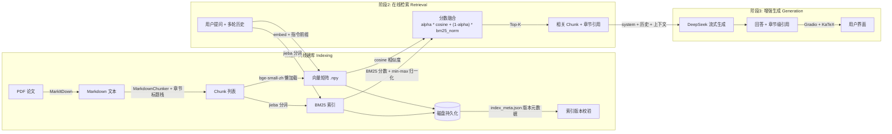

# Math RAG Assistant

> 基于混合检索（Hybrid Retrieval）的数学论文智能问答系统 —— 对任意 PDF 论文建立本地语义索引，通过 Web 界面进行带章节级引用的多轮问答。


---

## 项目简介

针对数学论文「公式密集、术语精确、中英混排」的检索难点，构建了 **Markdown 感知分块 → 双语向量化 → BM25 + 向量混合检索 → 流式增强生成** 的完整 RAG 管线。核心解决三个实际问题：

1. **通用 embedding 对中文数学论文检索失效** —— 换用中英双语模型 `bge-small-zh-v1.5` 并应用 bge 官方推荐的检索指令前缀；
2. **纯向量检索对精确术语（如 `self-attention`、公式符号）命中率低** —— 引入 jieba 分词 BM25 关键词通道，与向量分数加权融合；
3. **回答引用粒度粗** —— 分块器维护标题栈，引用精确到章节（如 `3.1 Scaled Dot-Product Attention`）。

---

## 技术栈

| 层级 | 技术 | 应用点 |
|------|------|--------|
| **Embedding** | `BAAI/bge-small-zh-v1.5` (Sentence-Transformers) | 中英双语向量化、L2 归一化、查询指令前缀、懒加载 |
| **混合检索** | NumPy + `rank_bm25` + jieba | Cosine 与 BM25 分数加权融合（α 可调）、min-max 归一化、中英混合分词 |
| **分块策略** | 自研 MarkdownChunker | 公式/代码块原子单元保护、章节标题栈、overlap 修正 |
| **生成** | DeepSeek API (OpenAI SDK) | 多轮上下文、流式输出、60s 超时、max_tokens 控制 |
| **前端** | Gradio 6 Blocks | 流式聊天、深色主题、侧边栏、原生 LaTeX 渲染 |
| **工程化** | `typing.Protocol` / dataclass / python-dotenv / pytest | 组件契约解耦、配置管理、离线可跑测试套件 |

---

## 系统架构



---

## 核心技术点与设计决策

### 1. 混合检索：解决数学论文「精确术语」检索失效

**问题**：纯向量检索对中文数学场景的精确术语（`transformer`、`scaled dot-product attention`）和公式命中率低，`all-MiniLM-L6-v2` 这类英文通用模型对中文基本无效。

**方案**：
- 双语模型 `bge-small-zh-v1.5` 作为语义通道，查询侧附加 bge 官方检索指令前缀（query instruction）；
- 并行构建 BM25 关键词索引：jieba 精确模式处理中文，英文小写按 token 切分，纯符号 token 过滤；
- 分数融合：`final = α · cosine + (1-α) · bm25_norm`，BM25 分数经 min-max 归一化到 [0,1]，α 默认 0.7 可配置。

**修复的隐藏缺陷**：`rank_bm25` 使用 ATIRE 变体 idf 公式，当词出现在恰好一半文档时 idf 退化为 0，小语料（几篇论文）下关键词检索完全失效。通过构建后对 idf≤0 的词补正数下限修复。

### 2. 索引生命周期管理：版本校验与同步检测

**问题**：更换 embedding 模型后，旧向量矩阵维度不匹配会静默抛错且无提示；论文目录增删后索引静默过期。

**方案**：
- 持久化 `index_meta.json`（模型名/维度/来源文件/时间戳），加载时校验，不一致则拒绝加载并引导重建；
- 启动时对比论文目录与索引文件清单，检测到增删自动提示「需重建」；
- `pickle` 改为纯 JSON 持久化，消除反序列化安全隐患。

### 3. 章节级引用：标题栈驱动的分块元数据

**问题**：普通分块只记录文本与来源文件，回答无法定位到论文具体章节。

**方案**：分块器维护标题栈（`#`~`######` 级别归并），每个 chunk 携带所属章节路径（如 `Attention Is All You Need §3. Model Architecture / 3.1 Scaled Dot-Product Attention`），检索结果与回答引用均精确到章节级。

### 4. 对话体验：多轮上下文 + 流式输出

- 历史消息（最近 6 轮）拼入 prompt 参与生成，支持数学推导类追问；
- DeepSeek 流式生成逐段渲染，避免长回答白屏等待；
- OpenAI 客户端 60s 超时 + max_tokens 上限，网络故障快速失败而非悬挂。

### 5. 性能与资源控制：模型懒加载

embedding 模型在首次实际使用时才加载（构造零开销），未构建索引时 UI 秒开、不触发模型下载；已构建索引时启动即加载完成。

### 6. 工程化：协议化组件架构

通过 `typing.Protocol` 定义 Embedder / VectorStore / LLM / Chunker / Converter 契约（结构子类型，零继承），管线构造器支持依赖注入，组件可独立替换、测试可注入 stub。

---

## 检索效果实测

> 测试语料：《Attention Is All You Need》（单篇，10 个分块），bge-small-zh-v1.5 + BM25 混合检索

| 查询 | 命中 | 相关度 |
|------|------|--------|
| scaled dot-product attention 的公式 | `§3.1 Scaled Dot-Product Attention`（含公式块） | 0.768 |
| 位置编码 positional encoding | `§3.3 Positional Encoding` | 0.636 |
| 什么是自注意力机制？ | `§4. Why Self-Attention` | 0.254 |

中文表述与英文术语混合查询均可稳定命中对应章节，公式块与上下文一并召回。

---

## 快速开始

```bash
# 1. 安装依赖（首次使用自动下载 embedding 模型，约 95MB）
git clone https://github.com/mikulovesuki/math-rag-assistant.git
cd math-rag-assistant
pip install -r requirements.txt

# 2. 启动（访问 http://localhost:7860）
python main.py
```

界面内三步完成：**配置 DeepSeek API Key → 上传论文构建索引 → 智能问答**。

> 未配置 API Key 时自动降级为模板模式，可完整体验检索流程。

---

## 项目结构

```
math_rag_assistant/
├── main.py                  Gradio 6 Web UI（流式聊天 + 侧边栏 + LaTeX 渲染）
├── config.py                集中配置（模型/分块/检索/提示词，.env 覆盖）
├── requirements.txt
├── tests/                   pytest 套件（27 用例，stub 注入离线可跑）
│   ├── conftest.py          确定性向量 stub / 固定回答 LLM
│   ├── test_chunker.py      公式/代码块保护、标题路径、overlap
│   ├── test_hybrid.py       混合检索融合排序、分词、持久化
│   ├── test_pipeline.py     端到端（临时目录隔离，不污染真实索引）
│   └── test_vector_store.py JSON 持久化、版本校验
└── core/
    ├── models.py            数据模型 (Document, Chunk)
    ├── protocols.py         组件契约（typing.Protocol）
    ├── converter.py         MarkItDown 封装（PDF/Word/PPT → Markdown）
    ├── chunker.py           原子单元分块 + 章节标题栈
    ├── embedder.py          bge-small-zh 懒加载封装
    ├── hybrid_retriever.py  BM25 + Cosine 混合检索
    ├── vector_store.py      NumPy 向量库 + JSON 持久化 + 版本校验
    ├── llm.py               DeepSeek 封装（多轮/流式/超时）
    └── pipeline.py          RAG 管线编排（组件可注入）
```

---

## 配置项

| 配置项 | 默认值 | 说明 |
|--------|--------|------|
| `DEEPSEEK_API_KEY` | - | DeepSeek API Key（界面内配置或 `.env`） |
| `DEEPSEEK_MODEL` | `deepseek-chat` | 可切换 `deepseek-reasoner` 深度推理 |
| `EMBEDDING_MODEL` | `BAAI/bge-small-zh-v1.5` | 可替换 `BAAI/bge-m3` 等 |
| `BM25_ALPHA` | `0.7` | 混合检索融合权重（向量/关键词） |
| `CHUNK_SIZE` | `800` | 分块最大字符数 |
| `CHUNK_OVERLAP` | `100` | 相邻块重叠字符数 |
| `TOP_K` | `5` | 检索返回块数 |

---

## 测试

```bash
python -m pytest tests/ -v
```

测试设计要点：

- **离线可跑**：stub embedder（确定性向量）与 stub LLM（固定回答）注入，不依赖模型下载与外部 API；
- **隔离性**：端到端测试使用临时目录，不触碰真实 `data/index`；
- **覆盖关键路径**：分块完整性、混合检索排序、索引版本校验、持久化往返、多轮问答、流式输出。

---

## Roadmap

- [ ] 交叉编码器 Rerank（Top-20 → Top-5 重排序）
- [ ] 增量索引（按文件增删局部更新，避免全量重建）
- [ ] 查询改写（HyDE / 查询扩展）
- [ ] Docker 一键部署

---

## License

MIT