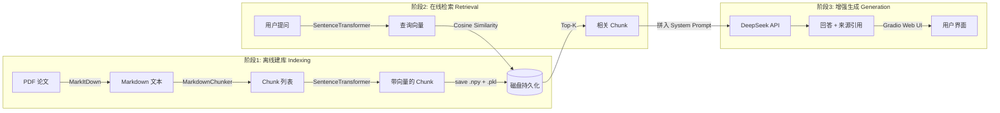

# Math RAG Assistant

基于 RAG（检索增强生成）架构的数学论文智能问答系统。上传 PDF 论文，系统自动完成文档转换、语义分块、向量化索引，用户通过 Web 界面提问，AI 基于论文内容生成带来源引用的回答。

## Tech Stack

| 层级 | 技术 | 用途 |
|------|------|------|
| **文档处理** | MarkItDown (Microsoft) | PDF / Word / PPT -> Markdown 文本转换 |
| **分块策略** | 自研 MarkdownChunker | 原子单元拆分，保护 `$$公式$$` 和 `` `代码块` `` 不被切断 |
| **向量化** | Sentence-Transformers (`all-MiniLM-L6-v2`) | 本地 Embedding，L2 归一化，无需 API |
| **向量检索** | NumPy + Cosine Similarity | 内存矩阵检索，支持磁盘持久化 |
| **LLM** | DeepSeek (OpenAI-compatible API) | 上下文增强生成，支持 `deepseek-chat` / `deepseek-reasoner` |
| **前端** | Gradio Blocks | 可折叠侧边栏 + 深色聊天界面 + 面板切换 |
| **工程化** | Protocol 接口协议 / dataclass / .env 配置 | 模块解耦，组件可替换 |

## Architecture



## Key Features

- **Markdown 感知分块** -- 自动识别 `$$...$$` 公式块、`` `...` `` 代码块、标题行和段落作为原子单元，保证语义完整性不被截断
- **向量索引持久化** -- 索引构建后自动保存到磁盘（`.npy` + `.pkl`），重启无需重新向量化
- **组件全可替换** -- Embedder / VectorStore / LLM / Chunker 均通过 Protocol 接口定义契约，零继承耦合
- **API Key 界面内配置** -- Web UI 直接填写密钥，自动写入 `.env`，无需命令行操作
- **前置检查防卡死** -- 未配置 API Key 或未建索引时立即返回引导提示，不触发模型加载
- **可折叠侧边栏** -- 深色主题侧边栏支持一键收起，聊天区域自适应占满全屏

## Quick Start

```bash
# 1. 安装依赖
git clone https://github.com/mikulovesuki/math-rag-assistant.git
cd math-rag-assistant
pip install -r requirements.txt

# 2. 启动（首次启动会在界面内引导配置 API Key）
python main.py
```

打开浏览器访问 `http://localhost:7860`，按界面引导三步完成：

1. **配置密钥** -- 粘贴 DeepSeek API Key（[获取地址](https://platform.deepseek.com/)）
2. **上传论文** -- 拖入 PDF/Word 文件，点击「构建索引」
3. **智能问答** -- 输入问题，获取基于论文内容的回答

> 未配置 API Key 时系统自动降级为模板模式，可正常体验检索流程。

## Project Structure

```
math_rag_assistant/
├── main.py                  Gradio Web UI（侧边栏 + 面板切换 + 深色主题）
├── config.py                全局配置（API Key / 模型 / 分块参数 / System Prompt）
├── requirements.txt
├── .env.example             API Key 模板
├── test_smoke.py            冒烟测试（分块器 / 模型 / 持久化）
├── test_e2e.py              端到端测试（建库 / 检索 / 问答 / 持久化验证）
├── core/
│   ├── models.py            数据模型 (Document, Chunk)
│   ├── converter.py         MarkItDown 封装 -- 多格式文档转文本
│   ├── chunker.py           Markdown 感知分块 -- 原子单元保护
│   ├── embedder.py          SentenceTransformer 封装 -- L2 归一化向量
│   ├── vector_store.py      NumPy 向量库 -- Cosine 检索 + 磁盘持久化
│   ├── llm.py               DeepSeek LLM 封装 -- OpenAI 兼容 SDK
│   └── pipeline.py          RAG 管线编排 -- 串联三阶段
└── data/
    ├── papers/              论文存放目录
    └── index/               向量索引持久化（自动生成）
```

## Configuration

| 配置项 | 默认值 | 说明 |
|--------|--------|------|
| `DEEPSEEK_API_KEY` | - | DeepSeek API Key，界面内配置或写入 `.env` |
| `DEEPSEEK_MODEL` | `deepseek-chat` | 可切换 `deepseek-reasoner` 进行深度推理 |
| `EMBEDDING_MODEL` | `all-MiniLM-L6-v2` | 本地 Embedding 模型，可替换为 BGE 系列 |
| `CHUNK_SIZE` | `800` | 每个分块最大字符数 |
| `CHUNK_OVERLAP` | `100` | 相邻块重叠字符数 |
| `TOP_K` | `5` | 检索返回的文档块数量 |

## Module Design

每个核心模块通过 Protocol 接口定义契约，可独立替换：

```python
# 替换 Embedding 模型
class MyEmbedder:
    def embed(self, text: str) -> np.ndarray: ...
    def embed_batch(self, texts: list[str]) -> list[np.ndarray]: ...

# 替换 LLM
class MyLLM:
    def generate(self, query: str, context: list[Chunk]) -> str: ...

# 替换向量存储
class MyVectorStore:
    def add(self, chunks: list[Chunk]) -> None: ...
    def search(self, query_vec: np.ndarray, top_k: int) -> list[Chunk]: ...
```

## License

MIT